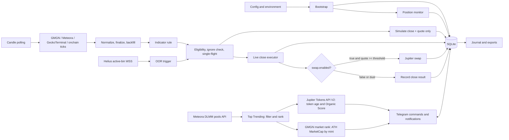

# Yolow Architecture

This document defines the initial folder structure and data flow for PRD v0.9.
Yolow runs as a single Node.js/TypeScript process, with SQLite as its runtime state store.

## Principles

- Run one agent process; modules are separated by responsibility, not deployed as separate services.
- Route every trigger through one eligibility check and one single-flight executor per position.
- Keep defaults and fixed parameters in config. Store per-position ignore flags and the active Telegram-selected timeframe in SQLite.
- Normalize candle providers to a common candle shape before indicator evaluation.
- Dry-run never signs or broadcasts transactions.

## Folder structure

```text
src/
  main.ts                 # bootstrap, wiring, shutdown
  config/
    load.ts               # load config and hot-reload
    schema.ts             # config validation
  domain/
    types.ts              # Position, Candle, Trigger, TxResult
  positions/
    monitor.ts            # position discovery and reconciliation
    ignore.ts             # persistent ignore flags in SQLite
  market-data/
    active-bin.ts         # Helius WSS and polling fallback
    candles.ts            # providers, fallback, normalization, finalization
    indicators.ts         # RSI, Bollinger Bands, MACD
    top-trending.ts       # Meteora DLMM candidates, Jupiter filters, and GMGN ATH enrichment
  triggers/
    indicator-exit.ts     # indicator rules on candle close
    oor-exit.ts           # bin distance and confirmation
    coordinator.ts        # eligibility, deduplication, single-flight
  execution/
    close.ts              # simulate, close, confirm, retry
    swap.ts               # Jupiter quote, swap, retry; record price impact without a guard
    reconcile.ts          # recover PENDING transactions at startup
  storage/
    db.ts                 # SQLite connection
    migrations.ts         # schema migrations
    repositories.ts       # position, trigger, and transaction state queries
  journal/
    journal.ts            # trade history and snapshots
    export.ts             # CSV, statistics, backups
    post-exit.ts          # post-exit price marks
  telegram/
    bot.ts                # bot connection and chat whitelist
    commands.ts           # commands and button callbacks
    messages.ts           # message formatting, keyboard, WIB time
  logger.ts               # structured logging and redaction

config.example.json
.env.example
data/                     # SQLite; not version-controlled
exports/                  # CSV; not version-controlled
backups/                  # SQLite backups; not version-controlled
```

The folders are responsibility boundaries. Add files when implementation size or testing needs make a narrower module useful.

## Data flow



## Flow rules

1. At startup, validate config, open SQLite, recover PENDING transactions, then reconcile wallet positions using `AGENT_WALLET_PUBKEY`.
2. Position and active-bin monitors run continuously. Subscribe to active-bin updates once per pool and reuse each pool feed for all its positions.
3. The candle engine selects the active provider, falls back and backfills when needed, then sends finalized candles to the indicator engine. OOR does not depend on candles.
4. Indicator and OOR triggers enter the coordinator. Before requesting a close, it checks wallet ownership, open status, position age when applicable, ignore state, and deduplication.
5. Before broadcasting a live close, re-check on-chain state and the ignore flag. Save the transaction signature and PENDING state before broadcast.
6. After a confirmed close, record the result. If `swap.enabled` is false, finalize as close-only. If true, attempt to swap close proceeds when they exceed the dust threshold, without rejecting a quote because of price impact. Record price impact for the journal and notifications. In dry-run, save a quote estimate without building or sending a swap transaction.
7. Persist every important state change in SQLite and send the corresponding Telegram notification.
8. `/ignore` and `/unignore` update SQLite immediately and persist across restarts. `/tf` updates the active timeframe, starts a fresh backfill, and persists the selected value in SQLite.
9. `TopTrendingService` fetches paginated DLMM pools from Meteora, applies all configured filters, enriches candidate tokens with Jupiter token data and GMGN ATH MarketCap, deduplicates by mint, then returns the ranked list to Telegram. Missing GMGN ATH data is displayed as unavailable; this feature does not call the execution pipeline.

## State ownership

| State | Source of truth |
|---|---|
| Parameters and providers | Validated `config.json` |
| API keys and bot token | `.env` |
| Monitored wallet | `AGENT_WALLET_PUBKEY` |
| Live signer | Keypair file outside the repository; `.env` stores only its path |
| Positions, ignore flags, Telegram-selected timeframe, transactions, candle audit, and journal | SQLite |

Never write a private key, seed phrase, or keypair contents to logs, the database, Telegram, or config files.

## Transaction boundaries

- `dry_run = true`: build and simulate as specified by the PRD, but do not sign or broadcast; label journal results as virtual.
- `swap.enabled = false`: continue closing positions, skip automatic swaps with status `SWAP_SKIPPED_DISABLED`.
- There is no maximum price-impact guard for swaps. Record and display quoted and realized impact so execution risk remains visible.
- An ignored position fails eligibility before execution. A transaction already broadcast cannot be cancelled by changing ignore state.
- Only one close may be active per position. Only one active-bin feed is needed per pool.
- Store all timestamps as UTC epoch milliseconds and format them as WIB when displayed.

## Next implementation decisions

Verify each provider candle format and API limits, pin the Meteora SDK version, and validate transaction reconciliation before enabling the relevant module in live mode. Provider changes must not alter the internal candle format.
