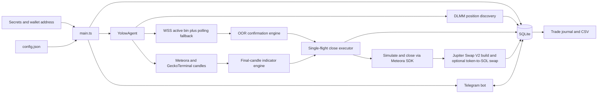

# Yolow Agent Architecture

Yolow runs as one Node.js process. `src/main.ts` loads and validates config, creates the Helius connection and SQLite database, starts the agent, then starts the whitelisted Telegram long poller.

## Runtime flow

## Modules

| Module | Responsibility |
|---|---|
| `src/main.ts` | Config and environment validation, Helius connection, SQLite, signer loading, graceful shutdown |
| `src/config/config.ts` | Startup schema checks for required settings and bounds |
| `src/positions/monitor.ts` | Discover/reconcile Meteora positions and persist ignore state |
| `src/market-data/active-bin.ts` | One active-bin subscription per pool, polling fallback, stale-feed suppression |
| `src/triggers/oor-exit.ts` | Per-position lower/upper range distance and confirmation timer |
| `src/market-data/candles.ts` | Normalize, gap-fill and finalize candles; build 15m Meteora candles from 5m data |
| `src/market-data/indicators.ts` | Wilder RSI(2), Bollinger upper band and MACD histogram exit rule |
| `src/execution/executor.ts` | Position close simulation/live execution, Jupiter swap, transaction journal, retry and restart reconciliation |
| `src/storage/db.ts` | SQLite tables, indexes and journal views |
| `src/journal/export.ts` | WIB-formatted trade CSV and Telegram document upload |
| `src/telegram/commands.ts` | Position controls, timeframe, journal commands and two-step `/golive` |
| `src/market-data/top-trending.ts` | Read-only Meteora DLMM token list, Jupiter enrichment and optional GMGN ATH field |

## Execution and state rules

- All close paths pass through one in-flight guard per position. Ignore state and position state are checked again before broadcast.
- A live close re-fetches the Meteora position, checks wallet ownership, builds a 100% remove-liquidity transaction, simulates it, saves its signature as `PENDING`, then broadcasts and confirms it.
- An ambiguous broadcast is stored as `UNKNOWN`; the agent does not resubmit that transaction. Startup and position discovery reconcile pending signatures and recover confirmed closes/swaps when the chain state is conclusive.
- A confirmed close swaps only the token amount credited by its own transaction, capped by that amount and the wallet's current token balance. Swaps use SOL output only, progressive slippage, a USD dust threshold and no price-impact veto.
- `/golive` validates the external keypair before showing a confirmation button. The callback validates the keypair again before changing SQLite mode to live.
- Position, trigger, transaction, candle, snapshot and journal timestamps are UTC epoch milliseconds. Telegram and CSV times use the configured time zone, defaulting to WIB (`Asia/Jakarta`).

## Current scope and known gaps

- Candle retrieval currently supports Meteora DLMM and GeckoTerminal. GMGN candles and `onchain_ticks` are placeholders; the fallback chain skips them. Without a supported candle response, indicator exits pause while active-bin OOR checks continue.
- The configured candle unit is attached to normalized data, but Meteora source prices still need comparison against the chosen chart before live indicator exits are relied on.
- The journal records first-seen SOL value estimates, close/swap balance deltas, candle context, snapshots, basic excursion statistics, and scheduled post-exit marks. On-chain open time, fees/rewards claimed, manual liquidity changes, accurate token USD PnL, and full trade-shape inference are not yet sourced.
- Invalid config fails startup. Config hot reload is not implemented; restart is required for config changes.
- Optional `swap.close_empty_token_account` is present in config but rent recovery is not implemented.

## Secrets and wallet

`.env` contains API keys, Telegram credentials, the monitored public key, and only a path to the live keypair. The keypair file must be outside the repository with restrictive permissions. Never write key material to SQLite, Telegram, or logs.
